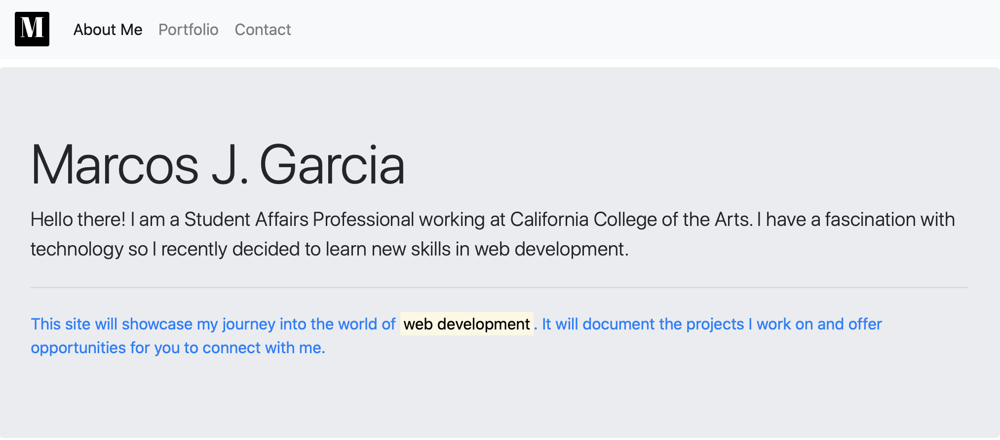

# Bootcamp-Week-2

##Screenshot of Website

## Link to Live

https://marcos-cmd.github.io/Bootstrap-Portfolio/

## GitHub URL

https://github.com/marcos-cmd/Bootstrap-Portfolio

## Customized Bootstrap Features Used
1. Custom Brand image in Navbar
2. Jumbotron on index.html
3. Placeholder cards for projects in portfolio.html
4. Responsive row of cards on contact.html
5. Used FontAwesome icons as buttons on contact.html

